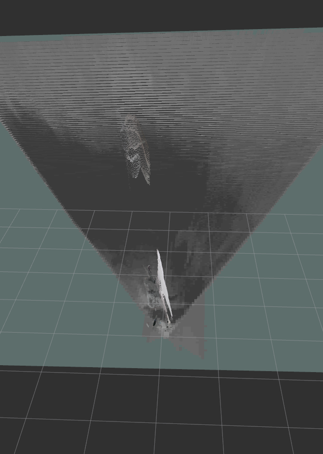

# Introduction

This deocument shows an example for using the RosIntegration of RaceCar for SLAM applications. 
Specificaly, we show how to run the [Google cartographer](https://google-cartographer.readthedocs.io/en/latest/) and how to tune 
RaceCar's sensing devices to the inputs required by the Cartographer. 

The [first section](#Cartographer-input-and-sensing-output) will provide a short overview of the input expected by the Cartographer, as well as the available output from the sensing devices of RaceCar 

The [second section](#Getting-started) is a practical guide for running the Cartographer under RaceCar.
If you are new to ROS, it is also recommended to read the [RosIntegration documentation](https://github.com/danielgreenberger/RaceCar/tree/master/RosIntegration/) to get up-to-speed with ROS basic functionality and RaceCar wrapper APIs.

The [third and last](#Algorithm-running-and-input-tune-in) section describes the iterative process of tuning the input from RaceCar sensing devices in order to construct a coherent map using Cartographer. It is somewhat verbose, but you can skip to the last running attempt to see the best result. 


# Cartographer input and sensing output.
## Cartographer input
(Go to the beginning)[#introduction]


A comprehensive guide on the required input can be found [here](https://google-cartographer-ros.readthedocs.io/en/latest/ros_api.html), under **Subscribed Topics**. 

The Cartographer can perform 2D or 3D mapping. 
This document focuses on 2D mapping as the output is easier to verify against a ground-truth.
However, this guide can be easily used for 3D mapping with minor modification, involving a small parameter change. 

### Range data
The Cartographer requires some range data as an input, such as PointCloud or Laser scan. Exactly one kind of range data can be supplied. 


### IMU (gyroscope and linear acceleration)

The cartographer may be supplied with IMU data, although it's optional for 2D mapping.
Nevertheless, we found out that IMU is needed for constructing a good map, especially gyroscope (for keeping track of the robot orientation during the SLAM process).


### Odometer
The Cartographer can also be provided with odometer data, which is the distance travelled from a fixed point.
Odometer data is not *required* by the cartographer, but similarly to IMU - it is highly needed for creating a good mapping.
 


The sensing devices used by the Cartographer:

### Intel RealSense depth Camera D435i
	
This is a camera able to provide depth-image as well as IMU data (gyroscope and linear acceleration). 
The depth-image can be used to produce PointCloud (using the RealSense API) or Laser scan (using the [depthimage-to-laserscan](https://wiki.ros.org/depthimage_to_laserscan) ROS package).


### Bitcraze Flow Breakout

This device can be used to provide Odometry data.

The output of the device includes the distance travelled in the X-Y direction as well as the distance from the floor. 

The Bitcraze output needs to be sampled constantly and converted to the X-Y distance in meters. 

Then, the new orientation of the robot needs to be determined, and the distance will need to be converted 
to the lab fixed frame. 

For more information on how to process the output, you can view the RaceCar implementation at [odometer_calculations.h](https://github.com/danielgreenberger/RaceCar/blob/master/Common/Coordinates/odometer_calculations.h) and [racecar_coordinates.h](https://github.com/danielgreenberger/RaceCar/blob/master/Common/Coordinates/racecar_coordinates.h)

**Note**: 
As of writing this document, we couldn't get a reliable reading from the bitcraze device. 

However, we developed and tested the entire software infrastructure for processing and publishing Odometer data, which can be used with an accurate Bitcraze reading. 

More info can be found at the files mentioned above. 

As for the implementation, we tried avoiding using ROS-specific tools to make it portable to other platforms. 


	
	


# Getting started

(Go to the beginning)[#introduction]

This section will describe how to run Google Cartographer under the Racecar environment using ROS. 


Open 3 different terminals, which will be used for the **RaceCar**, **RealSense** and **Cartographer** nodes.

## Step 1: Sourcing the workspaces


First make sure you have sourced all the workspaces (one workspace needs to be sourced for each terminal):

### Cartographer  (terminal 1)

```
source /home/nvidia/catkin_ws_cartog_2020/install_isolated/setup.bash
```

Alternatively, if you want to source it by default you can add it to the bash environment (not recommended, since the default ws is currently the RealSense workspace):

```
echo "source /home/nvidia/catkin_ws_cartog_2020/install_isolated/setup.bash" >> ~/.bashrc
source ~/.bashrc
```


**Note:** 
If you haven't yet installed google-cartographer, see the [official guide](https://google-cartographer-ros.readthedocs.io/en/latest/compilation.html#building-installation) for more details. 
We recommend not using the ninja build as it may compicate the compilation process under the Jetson linux kernel. 
During the installation we found some packages to be missing:
- glog (Google log)
- ceres-solver

If they are not installed automatically, just install them using apt-get.


### RealSense  (terminal 2) 

**This step is relevant only if you chose to use the official ReslSense ROS wrapper**

The Realsense library should be sourced by default. 
If this is not the case:

```
echo "source /home/nvidia/catkin_ws_realsense_2020/devel/setup.bash" >> ~/.bashrc
source ~/.bashrc
```


### RaceCar  (terminal 3) 

```
source /home/nvidia/daniel_greenberger/final/catkin_ws/devel/setup.bash
```


## Step 2 : Running the RealSense camera node

(Go to the beginning)[#introduction]

**This step is relevant only if you chose to use the official ReslSense ROS wrapper**

run in the terminal:

```
roslaunch realsense2_camera cartographer.launch
```

**cartographer.launch** is a modified launch file located at ``` /home/nvidia/catkin_ws_realsense_2020/src/realsense-ros/launch ``` and is based on demo_pointcloud.launch. 

We chose to base on this specific launch file as it had the PointCloud option already included.

The modifications performed to demo_pointcloud.launch:
1. Add the IMU topic, as this ia required by the Cartographer for 3D mapping. 
2. Perform [remapping](http://wiki.ros.org/roslaunch/XML/remap) of the PointCloud and IMU topics, so they will match with the topics the Cartographer listens to. 

**Note:** The remmaping of topics can also be done at the Cartographer lua script. In such case, we would remap in the reverse direction (from the Cartographer input names to the RealSense names). To see an example of such ramapping look at the other cartograoher launch files.  


## Step 3 : Running the RaceCar node

In **terminal 3**:

```
rosrun racecar racecar
```


## Step 4 : Running the Google Cartographer

(Go to the beginning)[#introduction]


There are many options for running the Cartographer:
#### **Online / Offline** 
Online  -   map and location is generated based on sensor data which is supplied in real-time

Offline  -  map and location is generated based on a rosbag recording which is played by the cartographer. 

#### **2D / 2D** 

The Cartographer can create 3D or 2D mapping. 
We have focused on 2D mapping since we saw it as a good starting point for checking the generated map and trajectory against 
a physical ground truth.

#### Other tuning options

There are many other options to [tune the algorithm](https://google-cartographer-ros.readthedocs.io/en/latest/tuning.html) to your specific needs. 

Some tuning options include:
TODO


Each options has it's own launch file and possibly a different lua configuration file (i.e 3D vs. 2D SLAM). 

To understand how to config the launch and lua files, please visit the [Cartographer documentation](https://google-cartographer-ros.readthedocs.io/en/latest/your_bag.html).

Below are some options we have tried and tested. 


### Online SLAM - 2D
```
roslaunch cartographer_ros online_racecar_2d.launch
```

If you want to see the results in rviz, the following launch file will also open rviz with the relevant configurations:
```
roslaunch cartographer_ros online_racecar_2d_with_rviz.launch
```

The above launch files use the racecar_2d_pointcloud.lua file, which can be found [here](TODO-place link)


We have used the online running option, so our launch file was based on **my_robot.launch**


**To collect the mapping results** you can open rviz and subscribe to the map topic.


### Offline SLAM - 2D

In Offline mode, we first collect the data by recording a [ros bag file](http://wiki.ros.org/rosbag/Tutorials/Recording%20and%20playing%20back%20data).

The following command will begin recording sensor data into a file named **sensor_data.bag** which will be saved in the current directory. 

If you are using PointCloud:
```
rosbag record --output-name=sensor_data  /tf /tf_static /imu/data /camera/depth/color/points
```


If you are using LaserScan:
```
rosbag record --output-name=sensor_data  /tf /tf_static /imu/data /scan
```


After the data is recorded, the Cartographer can be used to construct the map and trajectory based on the recorded data:
```
roslaunch cartographer_ros offline_racecar_2d.launch bag_filenames:=${PWD}/sensor_data.bag
```


# Algorithm running and input tune-in

(Go to the beginning)[#introduction]


Note: This section is a bit verbose. You can skip to the [last running attempt](#running-attempt-3-laser-data-no-odometer-tuning-the-realsense-sensors-data) for the best results.

## Running attempt #1: PointCloud2, no Odometer

The first mapping is described below.
We chose to first get a good mapping in 2D before trying the 3D mapping, 
as 2D maps are somewhat easier to imterpret and verify.

**Depth image type:**  PointCloud, as supplied by the RealSense ROS node. 

**Odometry used:** No odometry data (Bitcraze outputs garbage values.)

**Mapping type (2D/3D):** 2D


**More info:** 

We walked the robot around the lab (carried by hand) in a path following around the walls. 
The path included the main lab area as well as the small corridor, excluding the VISTA lab and other rooms such as the kitchen. 

The robot was held parrallel to the ground in a height of ~1.5 meters.





**Results**

Looking at the output figures (collected using rviz),
we can see that the initial results is not accurate at all. 
However, looking the zoom-in image (second figure) we may be able to see the corridor. 


## Running attempt #2: Laser data, no Odometer, static positioning of the robot


The conversion to Laser data was made using the [depthimage-to-laserscan](https://wiki.ros.org/depthimage_to_laserscan) package.

Install:
```
sudo apt-get install ros-melodic-depthimage-to-laserscan
```

Then, add it to the end of the RealSense launch file:
```
	<node name="depthimage_to_laserscan" pkg="depthimage_to_laserscan" type="depthimage_to_laserscan" > 
  	<remap from="image" to="/camera/depth/image_rect_raw"/>
	</node>
```


**Depth image type:**  Laser scan, produced by RealSense depth image and converted using depthimage_to_laserscan.

**Odometry used:** 

No odometry data (Bitcraze outputs garbage values). 

This seems to be the major cause of failure, as will be described.


**Mapping type (2D/3D):** 2D


**More info:** 

In order to neglect the (lack of) odometer - in this experiment we mounted the robot on a rotating chair at
the entrance to the corridor. 
The robot was moved slightly by making small rotations of the chair. 
The position of the robot as well as the chair are presented below


**Results**


As we can see, using static positioning, we can see how the Cartographer uses the Laser data to construct a map of the corridor. 

On the right-hand-side of the map, we can see a blurred-image of the recycling bin.

Looking at the results, we can deduce the following:

1. Although optional, an accurate Odometer is an important part of the SLAM process and should be supplied to the Cartographer. 

2. In cases where an Odometer is not relevant (i.e the robot is at the same position), we see that the Cartographer still has a problem with "unwrapping" the Laser/PointCloud data and constructing the map. This can be noticeable from the deformation od the walls, as well as the blurred-image of the recycling bin. 

    


## Running attempt #3: Laser data, no Odometer, tuning the RealSense sensors data


This experiment in similar conditions of the previous one, but we made some changes to the RealSense sensors data which significantly improved the results. 


The updated RealSense launch file containging the changes can be found [here](https://github.com/danielgreenberger/RaceCar/blob/master/RosIntegration/Cartographer/Launch/RealSense/cartographer.launch).


The changes we made:

1. Making sure that IMU data arrives at the max frequency possible (400 fps for gyro, 250 fps for acceleration)

2. Disable frame sync - This option gathers closest frames of different sensors, infra red, color and depth, to be sent with the same timetag. We wanted the timestamp to be as accurate as possible and threfore disabled this option. 

3. We united the 2 IMU streams (accel and gyro) into 1 unifies stream. The streams were united using linear_interpolation. More info can be found [here](https://github.com/IntelRealSense/realsense-ros) (under **unite_imu_method**). 


The last change seems to have the most effect, as unlike previous attempts, the Cartographer was able to use the Gyro data to detect the rotation of the robot and therefore rotate the constructed map according to the robot current orientation. 


**Depth image type:**  Laser scan, produced by RealSense depth image and converted using depthimage_to_laserscan.

**Odometry used:** No odometry data . 

**Mapping type (2D/3D):** 2D


**More info:** 

The Odometer data is still missing in this experiment, and therefore we again wanted to minimize the need for it by sampling the environment from a fixed-point. 

The Robot was put on a wheeled-rotating-chair and which was positioned at a fixed point, at the entrance to the corridor. 


The Cartographer mapping was turned-on, and the chair was rotated in a slow motion for several minutes. 


**Results**


The improvement in the constructed map is very noticeable.  


Looking at the results, we can say a few things:

### Corridor mapping

1. We can clearly see the corridor and its bounding walls. The Cartographer has correctly marked the area of the corridor as "empty" (white) for the first few meters (each "box" is a meter). 

2. We can see that the Cartographer recognized the right wall as longer - this is due to the recycling bin positioned on the right.


### Lab mapping

We can also notice a less-accurate mapping of the lab main room. 

The Cartographer correctly detected the central space as "empty", although with less certainty, and the general rectangular layout of the tables. 

This is still not accurate enough, mainly because the robot stayed closer to the corridor entrance. 

It might have been more accurate if the robot was rotated for a few more minutes, 
allowing the cartographer to get a better certainty of the surroundings. 


### Mapping mistakes

The Cartographer incorrecly assumed that the robot has moved, as can be noticed by the blue marking on the map (it interpreted the chair-rotation as linear movement).  

Such mistakes can likely be solved by providing a reliable IMU.


The rest of the corridor was incorrectly marked as an obstacle. 
We can come up with 2 reasons as the root-cause:

1. The rest of the corridor is beyond the reliable range of the camera from the fixed point of the robot - unlikely as the declared depth-range of the RealSense device is ~10 meters. 

2. The detection error of the robot current position - most likely


### Summary

The tune-in of the parameters proved to be very successful for the construction of the map. 

We need to have a reliable Odometer measurement if we want an accurate mapping, as once we have an Odometer we can freely drive the robot around the lab and map the entire room with high precision. 


# Tips for running the cartographer

### Start with 2D mapping
If you have the option to do so, always start with 2D SLAM before going into three-dimensions. This is because with 3D results, mapping errors can be opaque and harder to visialize. 

### Prefer Laser scan over PointCloud
For 2D mapping, the Cartographer works works much better with Laser scan than point cloud. Another advantage of Laser scan is its light-weight memory foot-print, in comparison with point cloud (as for 2D laser scan we have 1 scan line, usually the middle row of the depth image). Memory size can be critical when trying to run the cartographer offline, as will be discussed next. 

### Offline vs. Online SLAM
The offline SLAM option seems to produce faster and more accurate results, at least for 2D mapping (we didn't check 3D). 
This makes sense, as with offline mode the algorithm has a "global" view of the data and may be able to find patterns more easily. 
Getting the same accuracy in online mode usually requires longer sampling of the sensor data. 

### Be wary of sharp movements
When traversing the environment for SLAM, be cautious with sharp movements in the trajectory, especially sharp rotations.  
The reason behind this, is the Cartographer depends on IMU data to detect linear and angular movements, and tries to reason them with the laser scan. However, IMU data will always contain some error, which may lose the Cartographer to lose track of it's current localization / orientation. 
In practice, we found out the Cartographer handles rotations quite-well, as long you you are reasonable. 

### Use IMU filtering


